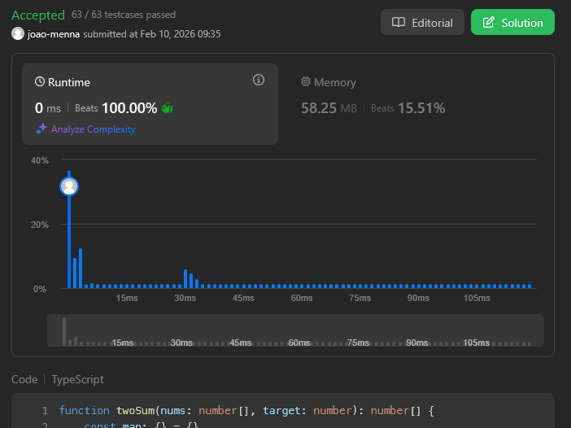

# Problema: Two Sum

Autor: **João Menna**
Revisado por: **João Izidoro**

Dado um array de números inteiros `nums` e um número inteiro `target` (alvo), retorne os índices dos dois números de modo que a soma deles seja igual ao `target`.

Você pode assumir que cada entrada teria **exatamente uma solução** e não pode usar o mesmo elemento duas vezes.

Você pode retornar a resposta em qualquer ordem.

# Exemplo:

## Primeiro:

**Entrada:** nums = [2,7,11,15], target = 9  

**Saída:** [0,1]  

**Explicação:** Como nums[0] + nums[1] == 9, retornamos [0, 1].

## Segundo:

**Entrada:** nums = [3,2,4], target = 6  

**Saída:** [1,2]

## Terceiro:

**Entrada:** nums = [3,3], target = 6  

**Saída:** [0,1]

# Restrições
* `2 <= nums.length <= 10⁴`
* `-10⁹ <= nums[i] <= 10⁹`
* `-10⁹ <= target <= 10⁹`
* Existe apenas uma resposta válida.

---

# Como o LLM foi utilizado:

Sempre que eu queria uma opinião ou estava travado sem saber como prosseguir, pedia uma explicação sobre o que eu estava deixando passar, sem exemplos de código, para ser capaz de atingir uma solução otimizada em $O(n)$.

# Evidência

