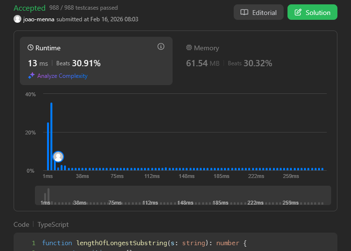

# Problema: Longest Substring Without Repeating Characters

Autor: **João Menna**
Revisado por: **João Izidoro**

Dada uma string `s`, encontre o comprimento da maior **substring** sem caracteres duplicados.

# Exemplo:

## Primeiro:

**Entrada:** s = "abcabcbb"  

**Saída:** 3  

**Explicação:** A resposta é "abc", com o comprimento de 3. Note que "bca" e "cab" também são respostas corretas.

## Segundo:

**Entrada:** s = "bbbbb"  

**Saída:** 1  

**Explicação:** A resposta é "b", com o comprimento de 1.

## Terceiro:

**Entrada:** s = "pwwkew"  

**Saída:** 3  

**Explicação:** A resposta é "wke", com o comprimento de 3. 

Note que a resposta deve ser uma **substring**; "pwke" é uma subsequência e não uma substring.

# Restrições
* `0 <= s.length <= 5 * 10⁴`
* `s` consiste em letras do alfabeto inglês, dígitos, símbolos e espaços.

---

# Como o LLM foi utilizado:

Sempre que eu queria uma opinião ou estava travado sem saber como prosseguir, pedia uma explicação sobre o que eu estava deixando passar, sem exemplos de código, para ser capaz de atingir uma solução otimizada utilizando a técnica de **Sliding Window** (Janela Deslizante) em $O(n)$.

# Evidência

