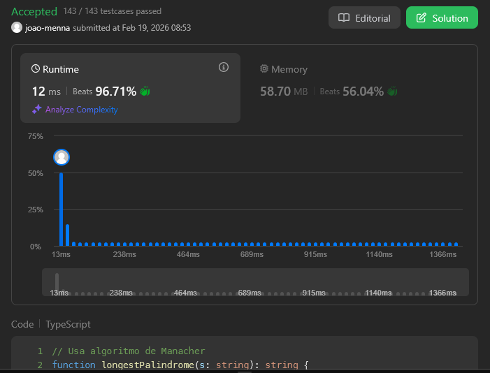

# Problema: Longest Palindromic Substring

Autor: **João Menna**
Revisado por: **João Izidoro**

Dada uma string `s`, retorne a maior **substring palindrômica** encontrada em `s`.

# Exemplo:

## Primeiro:
**Entrada:** s = "babad"  
**Saída:** "bab"  
**Explicação:** "aba" também é uma resposta válida.

## Segundo:
**Entrada:** s = "cbbd"  
**Saída:** "bb"

# Restrições
* `1 <= s.length <= 1000`
* `s` consiste apenas de dígitos e letras do alfabeto inglês (maiusculas e minúsculas).

---

# Como o LLM foi utilizado:

Sempre que eu queria uma opinião ou estava travado sem saber como prosseguir, pedia uma explicação sobre o que eu estava deixando passar, sem exemplos de código, para ser capaz de atingir uma solução otimizada utilizando o **Algoritmo de Manacher** ou a técnica de **Expansão pelo Centro**, visando eficiência de tempo superior à força bruta.

# Evidência

